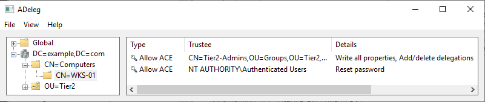
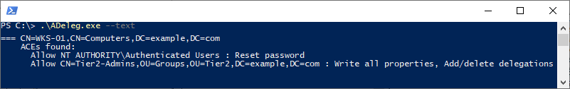

# ADeleg

  

Is an Active Directory delegation management tool. It allows you to make a detailed inventory of delegations set up so far in a forest, along with their potential issues:

- Objects owned by users
- Objects with ACEs for users
- Non canonical ACL
- Disabled ACL inheritance
- Default ACL modified in schema
- Deleted delegation trustees

## Usage

Download the [latest release here](https://github.com/mtth-bfft/adeleg/releases/latest) and double click on it for a graphical interface:

You can also use the tool from a terminal:

## FAQ

_How do I know if one result is important? Should I consider everything a problem?_ You should start reviewing delegations on your critical assets (domain controllers, domain admins, their admin workstations, servers with sensitive business data, etc.): are these delegations needed for a user or service to do their work? could they not work with fewer access rights, or on fewer objects?

_My forest has years of delegations built up, how am I supposed to handle that many warnings?_ You may want to run the analysis periodically and only focus on differences, so that you can start from a baseline and clean up delegations little by little over time.

_Can I import results from this tool into product <X>?_ Yes, if your tool knows how to parse CSV: `.\adeleg.exe --csv dump.csv`

## Copyright

All icons packaged with this project are the property of Microsoft Corporation.
For source code licensing, see LICENSE.md.